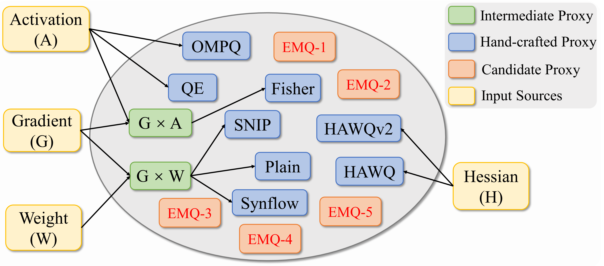

# EMQ: Evolving Training-free Proxies for Automated Mixed Precision Quantization 

This repository contains all the experiments of our paper "EMQ: Evolving Training-free Proxies for Automated Mixed Precision Quantization".  Final implementations in preparation.




## Acknowledgements

This repo is based on the following repos, thank the authors a lot.
- [BRECQ: Pushing the Limit of Post-Training Quantization by Block Reconstruction (ICLR 2021)](https://arxiv.org/abs/2102.05426)
- [OMPQ](https://github.com/MAC-AutoML/OMPQ/tree/master)

## Citation
If you find that this project helps your research, please consider citing some of the following papers:

```
@inproceedings{Dong2023EMQ,
    title={EMQ: Evolving Training-free Proxies for Automated Mixed Precision Quantization},
    author={Peijie Dong, Lujun Li, Zimian Wei, Xin Niu, ZHILIANG TIAN, Hengyue Pan},
    booktitle={International Conference on Computer Vision (ICCV)},
    year={2023}
}
```

